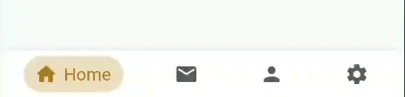

## Flutter - Bubble Animated Tabbar

### Preview



### Page View


<style type="text/css">
    img{ border:1px solid black }
</style>

### Getting Started

```yamlgit
dependencies:
	...
	bubble_animated_tabbar: 1.0.2
```

### Usage Example

Adding the widget

```dart
// Array of Tabs

List<Map> children = [
    {
      'icon': Icons.home,
      'title': 'Home',
      'iconSize':23,
      'color': Color.fromRGBO(186, 121, 9, 0.25),
      'textColor': Color.fromRGBO(173, 118, 23, 1),
      'customTextStyle':TextStyle(color: Color.fromRGBO(173, 118, 23, 1)),
    },
    {
      'icon': Icons.mail,
      'title': 'Messages',
      'color': Color.fromRGBO(0, 2, 148, 0.22),
      'textColor': Color.fromRGBO(26, 1, 135, 0.9),
    },
    {
      'icon': Icons.person,
      'title': 'User Account',
      'color': Color.fromRGBO(18, 140, 126, 0.25),
      'textColor': Color.fromRGBO(6, 125, 111, 1),
    },
  ];

  getBoxDecoration() {
    return BoxDecoration(
      color: Colors.white,
      boxShadow: [
        new BoxShadow(
          color: Color.fromRGBO(0, 0, 0, 0.1),
            blurRadius: 1.0,
            spreadRadius: 1.0
          )
        ]
    );
  }

// Add required properties for Animated TabBar
  @override
  Widget build(BuildContext context) {
    return Scaffold(
      appBar: AppBar( title: Text(children[_currentIndex]['title']) ),
      bottomNavigationBar: AnimatedTabbar(
        padding:EdgeInsets.only(left: 4, top: 6, right: 4, bottom: 6),
        containerDecoration: getBoxDecoration(),
        currentIndex: _currentIndex,
        onTap: onTabTapped,
        children: children,
      ),
    );
  }
```

## AnimatedTabbar Properties

| Property            | Type          | Required | Default Value |
| ------------------- | ------------- | -------- | ------------- |
| containerDecoration | BoxDecoration | NO       | --            |
| padding             | EdgeInsets    | NO       | --            |
| onTap               | Function      | Yes      | --            |
| children            | Array < Map > | Yes      | --            |

## Tab Properties

| Property        | Type       | Required | Default Value                     |
| --------------- | ---------- | -------- | --------------------------------- |
| icon            | IconData   | YES      | --                                |
| iconSize        | Int        | NO       | 20                                |
| title           | String     | YES      | --                                |
| color           | Color      | YES      | --                                |
| textColor       | Color      | YES      | --                                |
| tabPadding      | EdgeInsets | NO       | EdgeInsets.fromLTRB(10, 4, 10, 4) |
| customTextStyle | TextStyle  | NO       | --                                |
